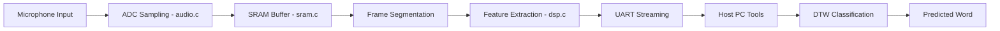
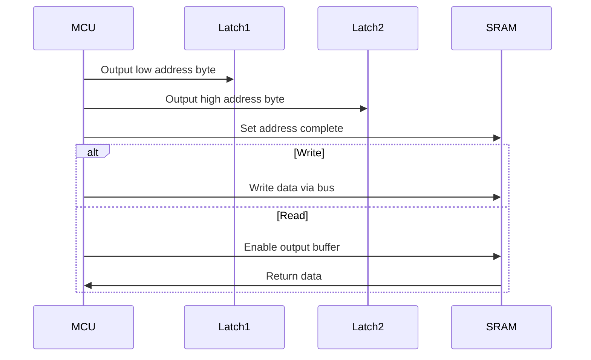

# Embedded Speech Recognition System (AVR + DTW + MFCC-Lite)

## System Architecture

### High-Level Pipeline

---

# Firmware modules

| Module      | Description                                           |
| ----------- | ----------------------------------------------------- |
| `audio.c`   | ADC sampling + timer control                          |
| `dsp.c`     | Feature extraction (MFCC-lite, energy, ZCR, centroid) |
| `fix_fft.c` | Fixed-point FFT for spectral analysis                 |
| `dtw.c`     | Dynamic Time Warping matching engine                  |
| `ext_int.c` | External interrupt handling                           |
| `uart.c`    | UART communication driver                             |
| `lcd.c`     | LCD display driver                                    |
| `sram.c`    | External SRAM control logic                           |

# Host side tool chain
| Script               | Purpose                                              |
| -------------------- | ---------------------------------------------------- |
| `features_stream.py` | Receives live feature vectors from AVR               |
| `features_train.py`  | Trains DTW templates and generates `dtw_templates.h` |
| `inference.py`       | Validates AVR predictions vs host model              |

# External SRAM Architecture

The system uses external SRAM for audio buffering due to limited AVR RAM.

Hardware Interface
Shared 8-bit data/address bus
Two 74373 latch registers (address demultiplexing)
SRAM read/write control via bus switching

# Audio Acquisition Modes
## Stream Mode
by typing in "_Stream_" inside the uart, the adc samples are streamed directly via uart

Used for debugging the mic and real-time monitoring using the uart_rec.py
## DSP mode
the default mode, can also be switched back using dsp

Samples stored in external SRAM (~8 KB buffer), Frames extracted after recording through dumping into the audio buffer

# Feature extraction
Each frame is converted into an 8-dimensional feature vector:

- Short-Time Energy
- Zero-Crossing Rate (ZCR)
- Spectral Centroid
- MFCC-lite coefficients

trims silent frames through checking its energy

# Classification DTW
Each word is stored as a feature template

Incoming sequence is compared against all templates inside dtw_template.h

Lowest DTW distance determines prediction